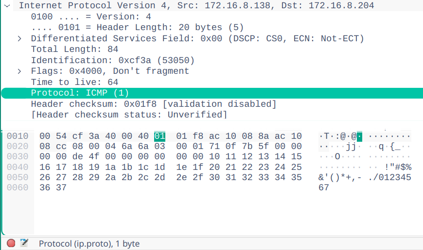

# Raúl Morales Ruiz

## Wireshark

- Observe la diferencia de tiempos. ¿Cómo hace ping para saber que los paquetes se pierden?

        raul@raul:~$ ping localhost     ($ ping mi_direccion_IP)
        PING localhost(localhost (::1)) 56 data bytes
        64 bytes from localhost (::1): icmp_seq=1 ttl=64 time=0.044 ms
        64 bytes from localhost (::1): icmp_seq=2 ttl=64 time=0.075 ms
        64 bytes from localhost (::1): icmp_seq=3 ttl=64 time=0.031 ms

        raul@raul:~$ ping 192.168.1.1   ($ ping direccion_IP_de_mi_vecino)
        PING 192.168.1.1 (192.168.1.1) 56(84) bytes of data.
        64 bytes from 192.168.1.1: icmp_seq=1 ttl=64 time=0.529 ms
        64 bytes from 192.168.1.1: icmp_seq=2 ttl=64 time=0.316 ms
        64 bytes from 192.168.1.1: icmp_seq=3 ttl=64 time=0.343 ms

        ping detecta los paquetes que se pierden, si el equipo destinatario no responde.

- Analicen, a continuación, las tramas capturadas ayudándose para ello de las siguientes cuestiones.

  - Para la trama Ethernet que contiene el mensaje "echo request":

    1.  ¿Cuál es la dirección Ethernet de 48-bit del interfaz de red de tu ordenador?

            Source: (96-48-fb-c3-51-c5)

    2.  ¿Cuál es la dirección Ethernet destino dentro de la trama Ethernet? ¿A qué dispositivo pertenece dicha dirección?

            Destination: (74:d4:35:2e:05:5c)
            Pertenece al equipo destino (compañero de clase).

    3.  ¿Cuál es el valor hexadecimal del campo Tipo de Trama (Frame Type)?

            Type: IPv4 (0x0800)

    4.  ¿Qué tamaño tiene el campo de datos de esta trama Ethernet?

            2 octetos (16 bits)

  - Y para la trama Ethernet que contiene el mensaje de respuesta "echo reply":

    1.  ¿Cuál es la dirección Ethernet origen dentro de la trama Ethernet? ¿A qué dispositivo pertenece dicha dirección?

            Source: (74:d4:35:2e:05:5c)
            Pertenece al equipo origen (compañero de clase).

    2.  ¿Cuál es la dirección destino dentro de la trama Ethernet? ¿A qué dispositivo pertenece dicha dirección?

            Destination: (96-48-fb-c3-51-c5)
            Pertenece al equipo destino (mi equipo).

    3.  ¿Cuál es el valor hexadecimal del campo Tipo de Trama (Frame Type)?

            ​Type: IPv4 (0x0800)

    4.  ¿Qué tamaño tiene el campo de datos de esta trama Ethernet?

            2 octetos (16 bits)

  - Muestre al profesor de prácticas el valor del campo, dentro de la cabecera IP, que ha permitido saber al analizador que el contenido del paquete IP era un paquete ICMP.

    
