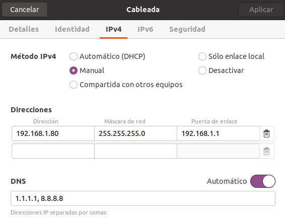
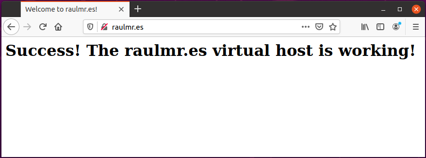
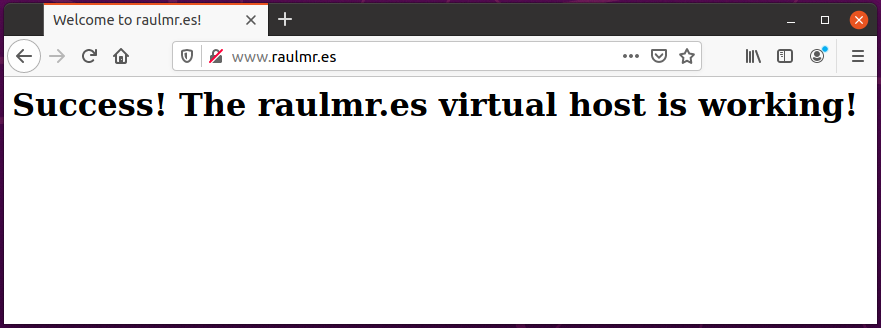
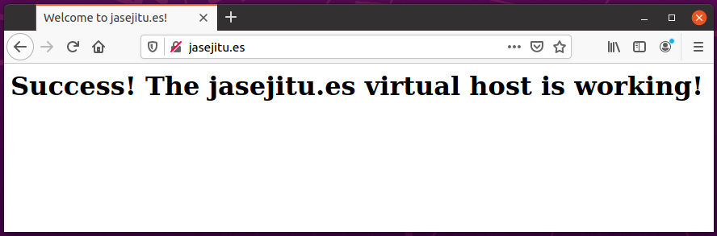
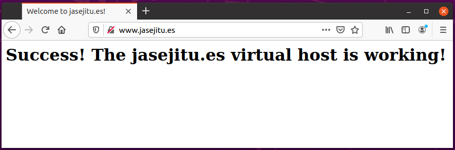

# Configuración Bind y Apache

## Introducción

En este ejercicio crearemos un sitio web y configuraremos un servidor DNS.

## Requisitos

- Máquina virtual para instalar sitio web (apache) y DNS (bind9).

- Instalar apache2

        sudo apt install apache2

- Instalar bind9

        sudo apt install bind9

## Administrar servidor web

- Detener el servidor web:

        sudo systemctl stop apache2

- Iniciar el servidor web:

        sudo systemctl start apache2

- Reiniciar el servidor web:

        sudo systemctl restart apache2

- Comprobar estado del servidor web:

        sudo systemctl status apache2

## Administrar servidor DNS

- Detener el servidor DNS:

        sudo systemctl stop bind9

- Iniciar el servidor DNS:

        sudo systemctl start bind9

- Reiniciar el servidor DNS:

        sudo systemctl restart bind9

- Comprobar estado del servidor DNS:

        sudo systemctl status bind9

## Configuración máquina virtual

- Aplicamos una dirección IP estática a la máquina virtual.
  192.168.1.80

  

## Configuración servidor DNS

### Zona raulmr.es

- Editamos el fichero que incluirá las diferentes zonas

        sudo vim /etc/bind/named.conf.local

- Insertamos los datos de nuestra zona

        zone "raulmr.es" {
            type master;
            file "/etc/bind/db.raulmr";
        };

- Creamos el fichero indicado en el parámetro "file"

        sudo vim /etc/bind/db.raulmr

- Editamos el fichero

        ;
        ; BIND data file for local loopback interface
        ;
        $TTL    604800
        @       IN      SOA     raulmr.es. root.raulmr.es. (
                                2           ; Serial
                                604800      ; Refresh
                                86400       ; Retry
                                2419200     ; Expire
                                604800 )    ; Negative Cache TTL
        ;
        @       IN      NS      raulmr.es.
        @       IN      A       192.168.1.80
        www     CNAME   raulmr.es.

### Zona inversa

- Editamos el fichero named.conf.local para insertar la zona inversa

        sudo vim /etc/bind/named.conf.local

- Agregamos los datos correspondientes:

        zone "1.168.192.in-addr.arpa" IN{
            type master;
            file "/etc/bind/db.192";
            allow-update { none; };
            allow-transfer { 192.168.1.80; };
        };

- Creamos el fichero indicado en el parámetro "file"

        sudo vim /etc/bind/db.192

- Editamos el fichero

        ;
        ; BIND reverse data file for local loopback interface
        ;
        $ORIGIN 1.168.192.in-addr-arpa.
        $TTL    604800
        @       IN      SOA     raulmr.es. root.raulmr.es. (
                                1           ; Serial
                                604800      ; Refresh
                                86400       ; Retry
                                2419200     ; Expire
                                604800 )    ; Negative Cache TTL
        ;
        @       IN      NS      raulmr.es.
        80      IN      PTR     raulmr.es.

### Zona jasejitu.es

- Editamos el fichero named.conf.local para insertar la zona del profesor

        sudo vim /etc/bind/named.conf.local

- Agregamos los datos correspondientes:

        zone "jasejitu.es" {
            type master;
            file "/etc/bind/db.jasejitu";
        };

- Creamos el fichero indicado en el parámetro "file"

        sudo vim /etc/bind/db.jasejitu

- Editamos el fichero

        ;
        ; BIND data file for local loopback interface
        ;
        $TTL    604800
        @       IN      SOA     jasejitu.es. root.jasejitu.es. (
                                2           ; Serial
                                604800      ; Refresh
                                86400       ; Retry
                                2419200     ; Expire
                                604800 )    ; Negative Cache TTL
        ;
        @       IN      NS      jasejitu.es.
        @       IN      A       192.168.1.80
        www     CNAME   jasejitu.es.

## Comprobaciones servidor DNS

- Reiniciamos el servidor DNS y comprobamos el estado actual

        sudo systemctl restart bind9.service
        sudo systemctl status bind9.service

- Comprobamos la respuesta de nuestro dominio

        dig @192.168.1.80 www.raulmr.es

- Deberíamos ver una respuesta parecida a la siguiente:

        ...

        ;; ANSWER SECTION:
        www.raulmr.es.		604800	IN	CNAME	raulmr.es.
        raulmr.es.		604800	IN	A	192.168.1.80

        ...

- Comprobamos la respuesta del dominio del profesor

        dig @192.168.1.80 www.jasejitu.es

- Deberíamos ver una respuesta parecida a la siguiente:

        ...

        ;; ANSWER SECTION:
        www.jasejitu.es.	604800	IN	CNAME	jasejitu.es.
        jasejitu.es.		604800	IN	A	192.168.1.80

        ...

- Editamos el fichero de configuración DNS de nuestra máquina virtual

        sudo vim /etc/resolv.conf

- Agregamos nuestro nameserver, quedando de la siguiente forma:

        #nameserver: IP de nuestra máquina virtual
        nameserver 192.168.1.80
        options edns0

## Configuración servidor web

### Sitio web raulmr.es

- Accedemos a la carpeta que contiene los sitios web

        cd /etc/apache2/sites-available/

- Creamos nuestro sitio web, copiando el sitio por defecto como plantilla

        sudo cp 000-default.conf raulmr.conf

- Editamos nuestro sitio web

        sudo vim raulmr.conf

- Añadimos el contenido correspondiente

        <VirtualHost *:80>
            ServerAdmin raul@raulmr.es
            ServerName raulmr.es
            ServerAlias www.raulmr.es
            DocumentRoot /var/www/raulmr.es
            ErrorLog ${APACHE_LOG_DIR}/error.log
            CustomLog ${APACHE_LOG_DIR}/access.log combined
        </VirtualHost>

- Accedemos a la carpeta que tendrá los ficheros de nuestro sitio web

        cd /var/www/

- Creamos la carpeta para nuestro sitio web y modificamos los permisos

        sudo mkdir raulmr.es
        sudo chown -R raul:raul raulmr.es

- Accedemos a la carpeta de nuestro sitio

        cd raulmr.es

- Creamos nuestro fichero index.html

        sudo vim index.html

- Insertamos el contenido

        <html>
            <head>
                <title>Welcome to raulmr.es!</title>
            </head>
            <body>
                <h1>Success!  The raulmr.es virtual host is working!</h1>
            </body>
        </html>

### Sitio web jasejitu.es

- Accedemos a la carpeta que contiene los sitios web

        cd /etc/apache2/sites-available/

- Creamos el sitio web del profesor, copiando el sitio por defecto como plantilla

        sudo cp 000-default.conf jasejitu.conf

- Editamos el sitio web del profesor

        sudo vim jasejitu.conf

- Añadimos el contenido correspondiente

        <VirtualHost *:80>
            ServerAdmin jasejitu@jasejitu.es
            ServerName jasejitu.es
            ServerAlias www.jasejitu.es
            DocumentRoot /var/www/jasejitu.es
            ErrorLog ${APACHE_LOG_DIR}/error.log
            CustomLog ${APACHE_LOG_DIR}/access.log combined
        </VirtualHost>

- Accedemos a la carpeta que tendrá los ficheros de nuestro sitio web

        cd /var/www/

- Creamos la carpeta para nuestro sitio web y modificamos los permisos

        sudo mkdir jasejitu.es
        sudo chown -R raul:raul jasejitu.es

- Accedemos a la carpeta de nuestro sitio

        cd jasejitu.es

- Creamos nuestro fichero index.html

        sudo vim index.html

- Insertamos el contenido

        <html>
            <head>
                <title>Welcome to jasejitu.es!</title>
            </head>
            <body>
                <h1>Success!  The jasejitu.es virtual host is working!</h1>
            </body>
        </html>

### Finalizar configuración servidor web

- Habilitar sitio web personal

        sudo a2ensite raulmr.conf

- Habilitar sitio web del profesor

        sudo a2ensite jasejitu.conf

- Recargamos el servidor web para aplicar los cambios

        sudo systemctl reload apache2

## Comprobaciones finales

### Acceso a servidor web personal

### Acceso a servidor web del profesor

## Raúl Morales Ruiz
