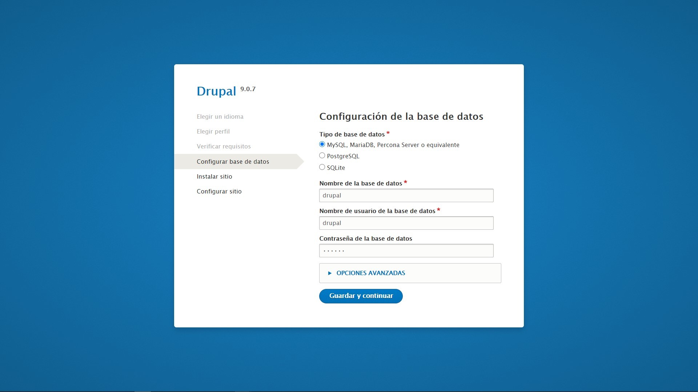
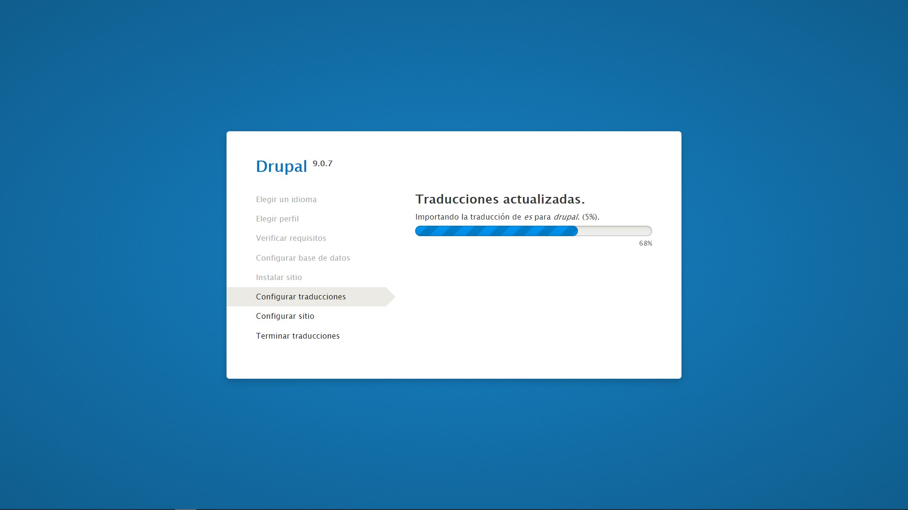
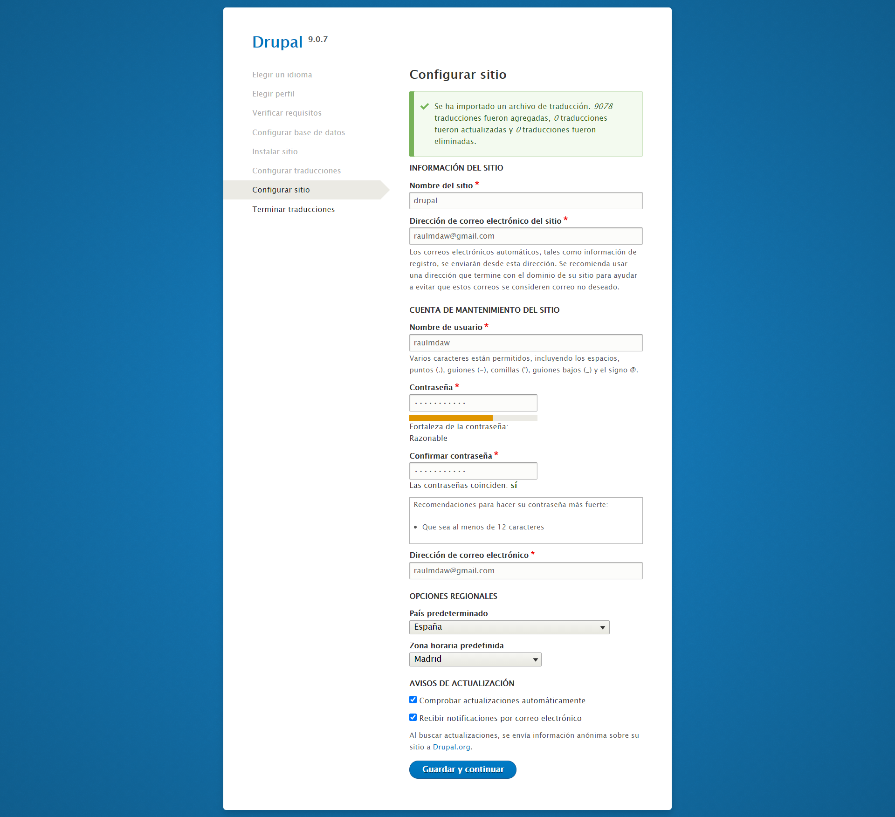
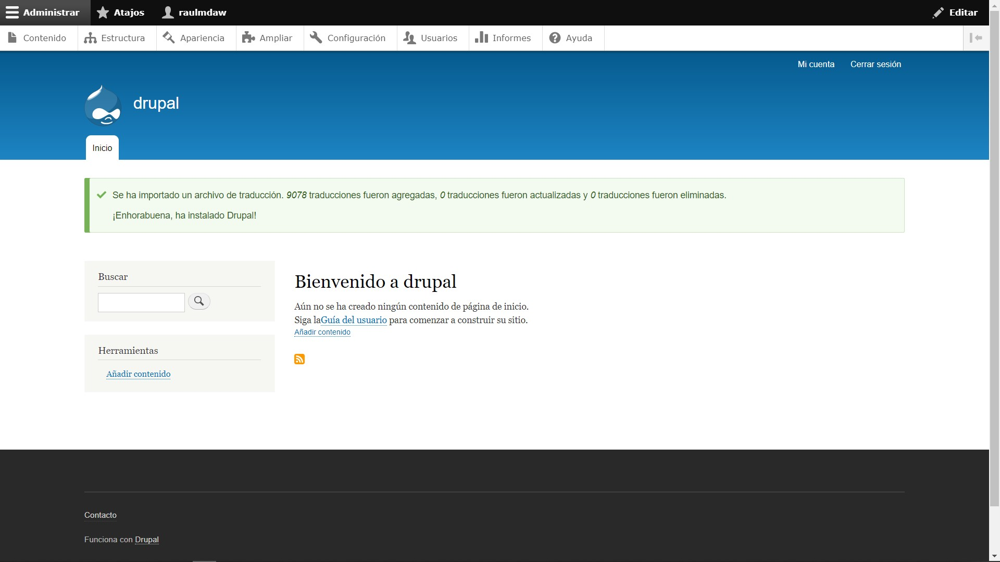
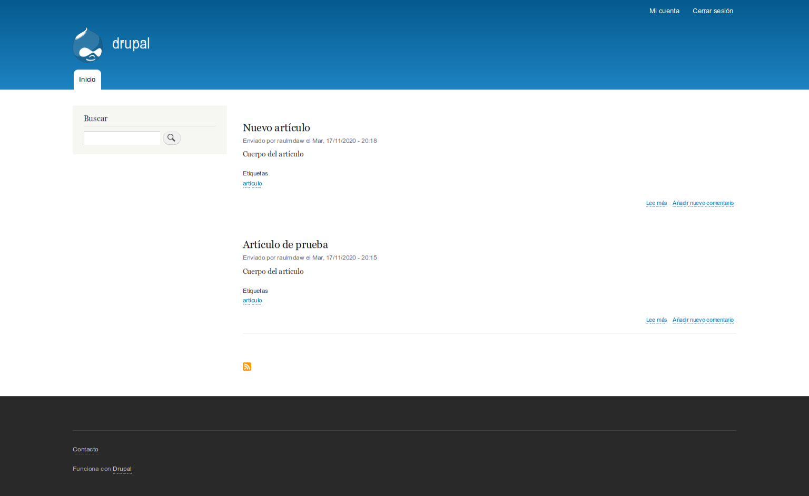

# Instalación de Drupal 9

#### Raúl Morales Ruiz

---

# Introducción

Drupal es un sistema de gestión de contenidos o CMS libre,​ modular, multipropósito y muy configurable.

Permite publicar artículos, imágenes, archivos y también ofrece la posibilidad de otros servicios añadidos como foros, encuestas, votaciones, blogs, administración de usuarios y permisos

# Requisitos

Para instalar Drupal usaremos dos contenedores Docker:

- Drupal.

- MySQL.

---

# Instalación de contenedor Docker Drupal

Drupal utiliza el puerto 80 internamente para funcionar.

En este caso hemos indicado que el puerto expuesto en nuestra máquina es el 8089.

        docker run --name drupal -p 8089:80 -d drupal

# Instalación de contenedor Docker MySQL

        $ docker run -d --name some-mysql --network some-network \
            -e MYSQL_DATABASE=drupal \
            -e MYSQL_USER=user \
            -e MYSQL_PASSWORD=password \
            -e MYSQL_ROOT_PASSWORD=password \
        mysql:5.7

---

# Creación de base de datos

Conectamos al servicio con el cliente mysql y un usuario administrador:

> ~\$ mysql -u root -p

Creamos la base de datos:

> create database drupal charset utf8mb4 collate utf8mb4_unicode_ci;

Si usamos MariaDB o MySQL 5 creamos el usuario de forma trivial:

> create user drupal@localhost identified by 'XXXXXXXX';

En caso de tratarse de MySQL 8 es importante asegurarse de usar el plugin de conexión adecuado:

> create user drupal@localhost identified with mysql_native_password by 'XXXXXXXX';

Concedemos los privilegios al usuario sobre la base de datos:

> grant all privileges on drupal.\* to drupal@localhost;

Y cerramos la conexión:

> exit

---

# Configuración de Drupal

1. Elegir idioma

   En la página inicial del instalador web elegiremos el idioma de la instalación.

2. Seleccionar perfil de instalación

   Habitualmente el perfil recomendado es el estándar, aunque si sabes lo que quieres puedes elegir otro.

3. Configuración de la base de datos

   El siguiente paso es la comprobación de requisitos para la instalación

4. Instalación

   Comienza el proceso de instalación:

5. Traducciones

   Se instalarán las traducciones de forma automática.

6. Configurar sitio

   Tras la inicialización de la base de datos, instalación de módulos, traducciones, etc. se pedirá la información básica de identificación del nuevo sitio web y los datos del usuario administrador:

7. Acceso a Drupal

   Finalmente se presentará el nuevo sitio Drupal 9 con sesión iniciada automáticamente para el usuario administrador.

---

# Creación de contenido

- Una vez dentro del portal de Drupal, accedemos a la sección "Contenido"

- Pulsamos el botón azul "Añadir contenido"

- Elegimos el tipo de contenido

  - Artículo
  - Página básica

- En este caso, se muestra la creación de un artículo:

  

- Tras crear el artículo, vemos el resultado:

  

---

# Visualización de contenido

Accedemos con un usuario sin permisos de administrador.

De esta forma vemos que el aspecto de la web es diferente.

