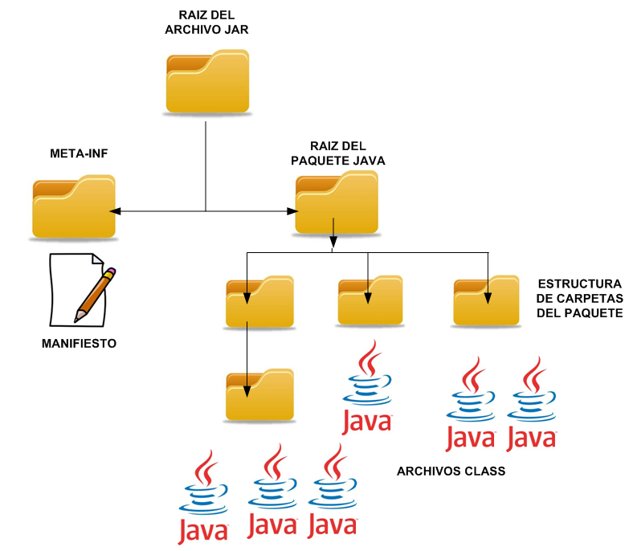

# Java

### Raúl Morales Ruiz

---

# Introducción

En este ejercicio se explicarán las diferentes ediciones de Java.
También se describirán los tipos de empaquetados o paquetes.

# Ediciones

Java es distribuido en tres diferentes ediciones:

- Java Micro Edition (Java ME)
- Java Standard Edition (Java SE)
- Java Enterprise Edition (Java EE)

## Java ME

Java Micro Edition, es una versión reducida de la edición Java Standard Edition.

Esta edición se encuentra enfocada para la creación de aplicaciones tanto en dispositivos móviles, como dispositivos integrados.

Con Java ME podemos desarrollar aplicaciones para diferentes dispositivos, no limitándonos únicamente a teléfonos inteligente.

Si así lo deseamos podemos crear aplicaciones para Televisores inteligentes, consolas de vídeo juegos, etc.

Aunque su popularidad se vio reducida por el auge de Android, hoy en día se encuentra retomando terreno principalmente por el tema del Internet de las cosas.

## Java SE

Java Standard Edition, es la edición estándar de Java.

Con esta versión podemos crear tanto aplicaciones web, como aplicaciones de escritorio.

La edición cuenta con una amplia biblioteca de clases las cuales están pensadas para agilizar el proceso de desarrollo. Tenemos clases enfocadas en seguridad, red, acceso a base de datos, interfaces gráficas, conexión entre dispositivos, XML, etc.

Esta edición provee una base solida del lenguaje, tocando temas como Java Virtual Machine, Java Runtime Environment, Java Development Kit, y API de Java.

Expliquemos cada uno de ellos:

### Java Virtual Machine (JVM)

Java es un lenguaje compilado. Cuando nosotros compilamos nuestras aplicaciones el resultado es un ByteCode.

La JVM será la encargada de tomar las instrucciones ByteCode y traducirlas a código maquina, algo que puede comprender y ejecutar.

Cada sistema operativo en particular necesita su propia implementación de la JVM, de lo contrario no sería posible ejecutar aplicaciones Java.

### Java Runtime Environment (JRE)

JRE es un conjunto de herramientas que proporcionan un entorno en donde las aplicaciones Java pueden ser ejecutadas. Cuando un usuario desea ejecutar un programa Java, este debe elegir el entorno que se adecue a sus necesidades (arquitectura y sistema operativo de la computadora).

Java es sumamente cuidadoso con las versiones. Si desarrollamos nuestras aplicaciones con X versión, muy probablemente no sean compatibles con una versión Y.

### Java Development Kit (JDK)

JDK es una extensión de JRE.

JDK incluye compiladores y herramientas (como JavaDoc y Java Debugger) para crear programas Java. Por esta razón, cuando uno quiere desarrollar una aplicación Java, necesitan instalar un JDK.

### API de Java

Java SE provee a una amplia biblioteca de clases las cuales están pensadas para agilizar nuestro proceso de desarrollo, son clases las cuales ya vienen con el lenguaje.

A esta biblioteca de clases se le denomina la API de JAVA. Esta puede ser consultada de forma gratuita en la documentación oficial de Java.

# Java EE

Java Enterprise Edition, es la mayor edición de Java.

Esta edición contiene toda la Standard Edition y mucho más. Por lo general es utiliza para crear aplicaciones con la arquitectura cliente servidor.

Java EE fue pensado para el mundo empresarial. Posee una amplia biblioteca de clases con las cuales podemos trabajar con JSON, Email, base de datos, transacciones, Persistencia, envió de mensajes, etc.

---

# Tipos de empaquetados en Java

Las aplicaciones de Java Empresarial pueden empaquetarse para su despliegue y distribución en tres formatos:

- Archivos Jar (Java Archive)
- Archivos War (Web Archive)
- Archivos Ear (Enterprise Archive)

En esencia, los tres formatos son archivos ZIP con la extensión cambiada. Los tres contienen archivos de clases Java compilados (.class), pueden contener archivos fuentes Java (.java) y de otro tipo, organizados en una estructura de carpetas.

El objetivo de estos archivos es el despliegue eficiente de las aplicaciones Java junto con los recursos que necesitan para su ejecución.

## Archivos JAR

Es la mínima unidad para empaquetar una aplicación Java. Los elementos componentes en un archivo jar pueden descargarse en una sola petición del entorno de ejecución, siendo esto más eficiente que la descarga de muchos archivos de clases no comprimidos.

La máquina virtual de java en el momento en que se ejecuta el jar, puede rechazar los archivos de clase cuya suma de chequeo no coincida con la que esta especificada en el manifiesto del jar.

Básicamente el archivo jar contiene dos carpetas:

- Una carpeta META-INF que puede contener el manifiesto
- Otra carpeta que es la raíz del paquete Java que estamos encapsulando.

Si nuestro paquete Java es por ejemplo org.apache.utils.axis, en el jar tendremos la carpeta org, dentro la carpeta apache, dentro la carpeta utils y por último la carpeta axis con los archivos .class que correspondientes a los archivos .java que tenemos en el proyecto.

### Estructura de un archivo JAR

## Diferencias entre archivos EAR y WAR

La mayor diferencia entre los archivos JAR, WAR y EAR es el hecho de que están dirigidos a diferentes entornos.

- Un archivo EAR requiere un servidor de aplicaciones totalmente compatible con la plataforma Java, Enterprise Edition (Java EE) o Jakarta Enterprise Edition (EE), como WebSphere o JBoss, para ejecutarse.

- Un archivo WAR solo requiere un servidor de aplicaciones compatible con Java EE Web Profile para ejecutarse, y un archivo JAR solo requiere una instalación Java.

También hay restricciones y requisitos internos que se aplican a los archivos EAR, WAR y JAR.

- Los archivos EAR deben tener un archivo application.xml contenido dentro de una carpeta llamada META-INF. Un archivo WAR requiere un archivo web.xml contenido en una carpeta WEB-INF.

- Los archivos Java no tienen ninguno de estos requisitos.
