# Tomcat

#### Raúl Morales Ruiz

---

## Introducción

El objetivo de este manual es utilizar tomcat para publicar un proyecto Java (CRUD).

## Requisitos

- Tener instalado [Java](https://www.java.com/es/).
- Tener instalado [Apache Tomcat](http://tomcat.apache.org/).

## Configuración del proyecto en Eclipse

A continuación se definen los pasos a seguir para exportar el proyecto Java desde Eclipse.

### Modificar fichero Application

Abrimos el fichero Application, normalmente ubicado en --> src/main/java/com."nombreProyecto"

Añadimos la siguiente línea:
> extends SpringBootServletInitializer

Debería quedar de la misma forma que aparece en la captura:

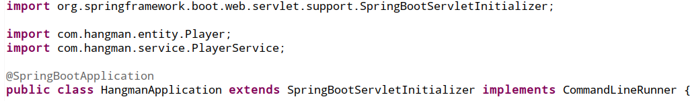

### Modificar fichero pom.xml

Abrimos el fichero pom.xml, normalmente ubicado en la raiz del proyecto.

- Añadimos la siguiente línea, justo después de "properties":
    > \<packaging>war\</packaging>
    
    Debería quedar de la misma forma que aparece en la captura:

    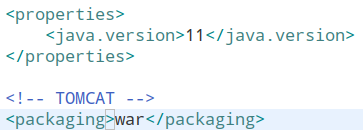

- Añadimos las siguientes líneas, justo antes de cerrar "dependencies":
        
        <dependency>
			<groupId>org.springframework.boot</groupId>
			<artifactId>spring-boot-starter-tomcat</artifactId>
			<scope>provided</scope>
		</dependency>
    
    Debería quedar de la misma forma que aparece en la captura:

    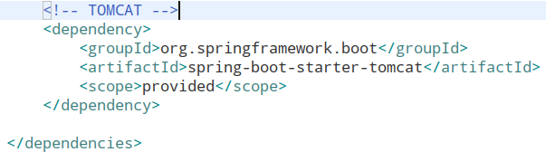

### Actualizar maven

Después de guardar las modificaciones del fichero pom.xml, podemos comprobar que el proyecto indica errores.

- Para solucionarlo, debemos actualizar Maven en nuestro proyecto:
    
    * Pulsamos "Alt + F5" en cualquier parte del workspace
    * Seleccionamos nuestro proyecto
    * Pulsamos OK

    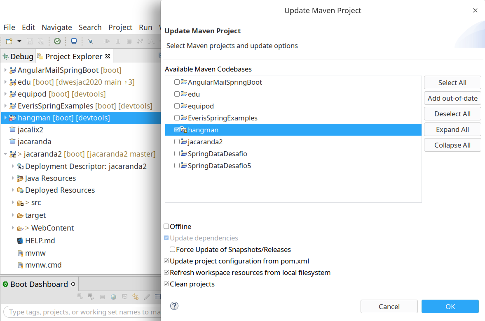

Una vez actualizado, podemos comprobar que ya no aparece ningún error en el proyecto.

### Maven install

Después de actualizar las dependencias, procedemos a generar el archivo war.

- Para generar el archivo .war, debemos actualizar Maven en nuestro proyecto:
    
    * Pulsamos "botón derecho" sobre el proyecto
    * Run As
    * Maven install

    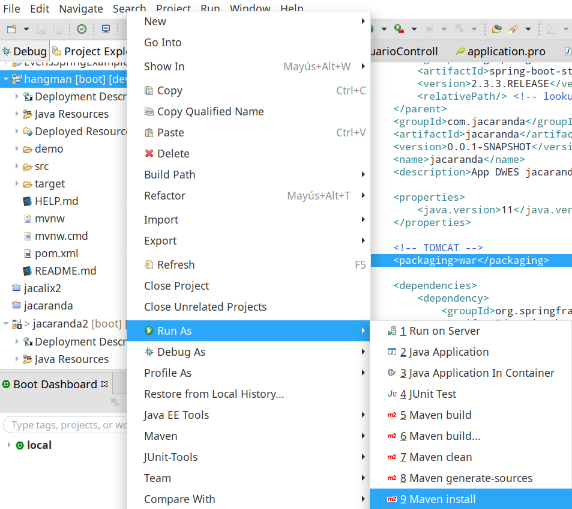

Una vez termine el proceso, si todo ha ido bien, podemos ver que el resultado final es "BUILD SUCCESS"

También podemos comprobar, en la carpeta "target" de nuestro proyecto, que aparece el fichero war correspondiente.

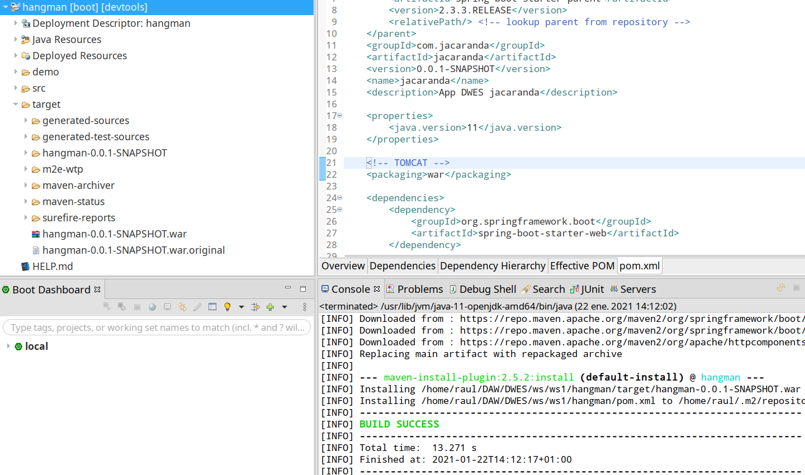

## Configuración del proyecto en Apache Tomcat

A continuación se definen los pasos a seguir para publicar el proyecto en Apache Tomcat.

### Publicar proyecto

Para publicar el proyecto, accedemos a nuestro servidor Tomcat:

- Abrimos el Gestor de Aplicaciones Web (manager webapp)
- Nos dirigimos a la sección "Archivo WAR a desplegar"
    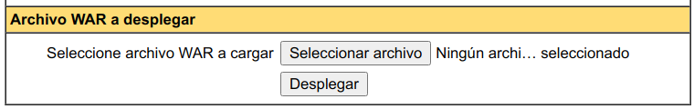
- Seleccionamos nuestro fichero war
- Pulsamos el botón "Desplegar"

Tras esperar un poco a que Tomcat publique nuestro proyecto, podemos comprobar que ya tenemos la aplicación en nuestro servidor y el mensaje correspondiente debe ser "OK".

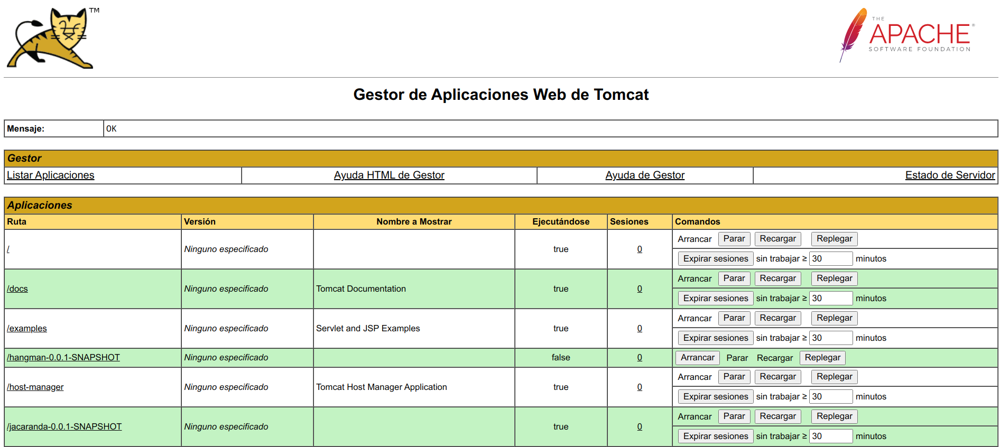

### Ejecutar proyecto

Para lanzar el proyecto, accedemos a nuestro servidor Tomcat:

- Abrimos el Gestor de Aplicaciones Web (manager webapp)
- Nos dirigimos a la sección "Aplicaciones"
- Pulsamos el botón "Arrancar" sobre nuestro proyecto

    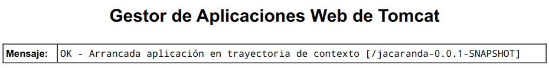

Tras esperar un poco a que Tomcat lance nuestro proyecto, podemos comprobar que el mensaje correspondiente debe ser "OK".

### Realizar peticiones

Para realizar peticiones, vamos a utilizar Postman y un navegador web.

- Primero, creamos un cliente desde Postman, realizando una petición POST:
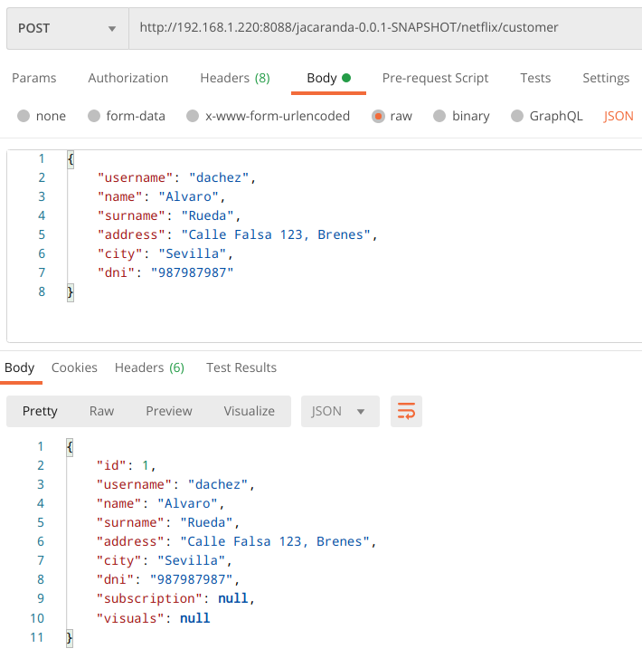

Podemos comprobar en Postman que la petición se ha realizado correctamente, viendo la respuesta obtenida.

Igualmente vamos a revisar el resultado obtenido desde el navegador:
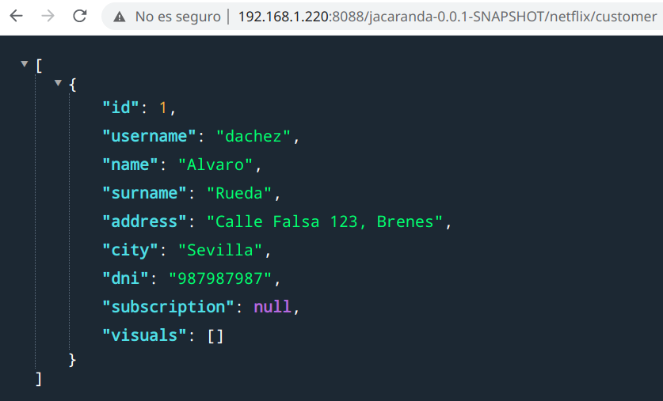

Vemos que el resultado obtenido es el mismo que en Postman.