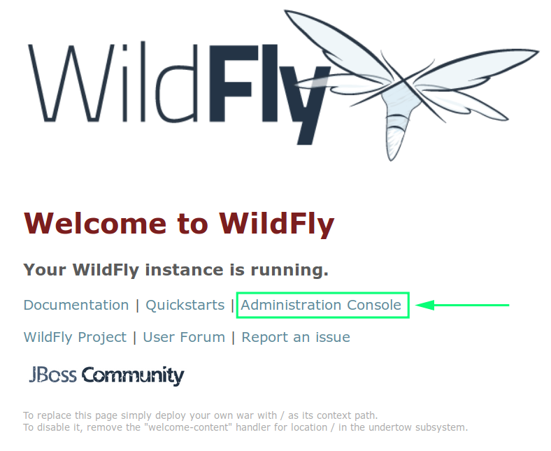

# Wildfly

#### Raúl Morales Ruiz

---

## Introducción

El objetivo de este manual es realizar la instalación de Wildfly.

## Requisitos

- Tener instalado [Docker](https://www.docker.com/).

## Instalación

A continuación se definen los pasos a seguir para descargar e instalar la imagen Docker de Wildfly.

### Ejecutar/descargar imagen Docker

Ejecutamos el siguiente comando en la terminal:

> $ docker run -p 8084:8080 -p 9990:9990 --name=wildfly -it jboss/wildfly /opt/jboss/wildfly/bin/standalone.sh -b 0.0.0.0 -bmanagement 0.0.0.0

- El puerto por defecto para la interfaz web es el 8080, en este caso se ha sustituido por el 8084.

- El puerto por defecto para la consola de administración es el 9990.

### Comprobar finalización de la instalación

Una vez hemos ejecutado el comando, podemos ver que en el proceso automático ejecutado en la terminal aparecen bastantes líneas con información.

Para comprobar que la instalación ha terminado, debemos revisar que la última línea sea parecida a esta:

> [org.jboss.as] (Controller Boot Thread) WFLYSRV0051: Admin console listening on http://0.0.0.0:9990

### Comprobar acceso

Una vez ha finalizado la instalación, podemos comprobar que tenemos acceso a la interfaz web desde cualquier navegador.

### Acceso a la consola de administración

Después de comprobar que tenemos acceso a la interfaz web, podemos intentar acceder a la consola de administración.

- Pulsamos el enlace [Administration Console](http://localhost:8084/console)

Como vemos en la captura, todavía no tenemos acceso a la consola porque no existe ningún usuario configurado.

#### Configurar acceso a la consola

Como podemos ver en la captura, se indica que debemos ejecutar el siguiente comando para configurar el acceso a la consola:

> add-user.sh

Como hemos realizado la instalación mediante Docker, debemos ejecutar este comando dentro del contenedor:

- Abrimos una nueva ventana o pestaña de la terminal

- Ejecutamos el siguiente comando, para acceder al contenedor:

    > $ docker exec -it wildfly bash

- Comprobamos que el prompt ha cambiado por alguno similar a este:

        [jboss@3ac140d73304 ~]$ 

- Ejecutamos el siguiente comando, para crear el acceso del usuario:

    > [jboss@3ac140d73304 ~]$ wildfly/bin/add-user.sh admin Admin --silent

        En este caso el usuario indicado es "admin" y la contraseña es "Admin", podemos indicar las credenciales que queramos.

#### Acceso a la consola (ahora sí)

Después de configurar el acceso correspondiente, podemos acceder a la consola de administración.

- Pulsamos el enlace [Administration Console](http://localhost:8084/console)

    

- Tras pulsar el enlace, debe aparecer una ventana donde introduciremos el usuario y contraseña del paso anterior:

    

### Consola de administración

Por último, después de haber accedido a la consola, podemos acceder a los distintos apartados de la misma.

En la siguiente captura podemos ver algunos como ejemplo:

